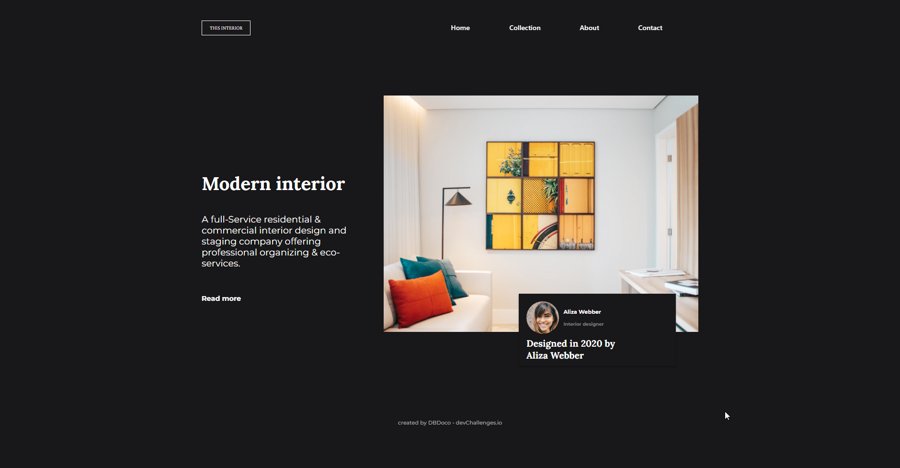

<h1 align="center">Interior Consultant - devChallenges.io</h1>

   Solution for a challenge from  <a href="http://devchallenges.io" target="_blank">Devchallenges.io</a>.

  <h3>
    <a href="https://lucent-lokum-0fe21a.netlify.app">
      Demo
    </a>
     | 
    <a href="https://devchallenges.io/solutions/7HJOQimJ9CQ268Hq5QTy">
      Solution
    </a>
     | 
    <a href="https://devchallenges.io/challenges/Jymh2b2FyebRTUljkNcb">
      Challenge
    </a>
  </h3>

<!-- TABLE OF CONTENTS -->

## Table of Contents

- [Overview](#overview)
- [Built With](#built-with)
- [Features](#features)

<!-- OVERVIEW -->

## Overview

### Built With

- [Bootstrap](https://getbootstrap.com)

## Features

This application/site was created as a submission to a [DevChallenges](https://devchallenges.io/challenges) challenge. The [challenge](https://devchallenges.io/challenges/Jymh2b2FyebRTUljkNcb) was to build an application to complete the given user stories.
